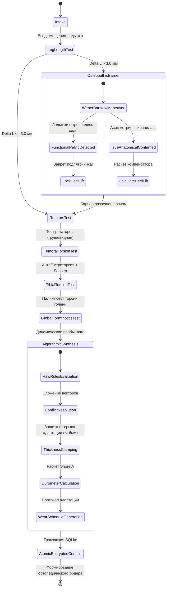

# Усовершенствованный план реализации: Клиническая рабочая станция ортопедической диагностики и подбора клиньев (.NET 10 MAUI / C# 14)

Детальный план реализации оффлайн-модуля медицинской рабочей станции для ортопедов-подиатров с глубокими усовершенствованиями **алгоритмического аппарата**, **клинической бизнес-логики (FSM)** и **интуитивности интерфейса (UX/UI)** на основе [requirments_BiomechanicalDiagnostics.md](file:///c:/Users/vladimir/source/repos/BiomechanicalDiagnostics/md/requirments_BiomechanicalDiagnostics.md).

---

## User Review Required

> [!IMPORTANT]
> **Усовершенствования алгоритмов и биомеханики**:
> 1. **Детектор и резольвер коллизий клиньев (Wedge Stacking & Conflict Resolver)**: Если разнонаправленные тесты назначают клинья в противодействующие зоны (например, супинация заднего отдела при пронации переднего), алгоритм рассчитывает результирующий вектор момента силы $M_{resultant}$ и предел суммарной толщины (не более $6.0$ мм для сохранения адаптивной ёмкости стопы).
> 2. **Расчет плотности материала (Твердость по Шору А)**: Добавлен детерминированный расчет необходимой жесткости клиньев в зависимости от индекса активности: Sedentary $\rightarrow$ 35 Shore A (мягкий EVA), Moderate $\rightarrow$ 45 Shore A, Active $\rightarrow$ 55 Shore A, Athlete $\rightarrow$ 65 Shore A (высокоплотный формованный композит против усталостного сминания).
> 3. **Расчет узлов и пучностей стоячей волны (Торсионный конфликт Теста 5)**: Точный расчет координат зон максимального сдвигового напряжения в феморо-пателлярном и тибио-феморальном суставах с динамической угловой скоростью $\omega(activity)$, отражающей частоту шагового цикла.

> [!TIP]
> **Усовершенствования клинической бизнес-логики (FSM)**:
> 1. **Строгий конечный автомат (FSM)** с 7 детерминированными состояниями:
>    `Intake` $\rightarrow$ `LimbDiscrepancyCheck` $\rightarrow$ `OsteopathicGating` (при $\Delta L > 3.0$ мм) $\rightarrow$ `RotatorAssessment` $\rightarrow$ `FemoralTorsion` $\rightarrow$ `TibialTorsion` $\rightarrow$ `DynamicGaitSynthesis` $\rightarrow$ `AtomicCommit`.
> 2. **Интерактивный клинический маршрутизатор маневра Вебера-Барстоу**: Пошаговый алгоритм дифференциации (пальпация медиальных лодыжек в положении сидя/лежа, флексионный тест стоя, тест отведения бедра) для исключения ятрогенного перекоса таза.
> 3. **График адаптации и реабилитации (Wear-in Schedule Protocol)**: Автоматическая генерация индивидуального протокола привыкания к стелькам (дни 1–3: 2 часа/день, дни 4–7: 4–5 часов/день, со 2-й недели: полная нагрузка; контрольный визит через 21 день).

> [!NOTE]
> **Усовершенствования интерфейса (GUI Intuitivity)**:
> 1. **Два режима работы**: 
>    * **Clinical Wizard (Пошаговый мастер)** с авто-валидацией каждого шага — идеален для стандартизированного протокола приема.
>    * **Rapid Diagnostic Matrix (Быстрая матрица)** — компактная панель для опытных врачей на кушетке.
> 2. **Интерактивная карта плантарной поверхности стопы (Plantar Insole Interactive Canvas)**: Помимо адаптивного клина с волной, добавлен канвас стельки, на котором в реальном времени визуализируются зоны наложения клиньев (передний наружный, передний медиальный, задний медиальный, 5-я плюсневая кость, подпяточник) с цветовой градацией толщины.
> 3. **Тактильная эргономика**: 
>    * Однокасательные селекторы (Large Touch Targets $\ge 48\times 48$ dp) для работы в медицинских перчатках.
>    * Haptic-feedback 3 уровней (легкий щелчок при смене положений, двойной импульс при нормализации, длинный `LongPress` при превышении остеопатического порога 3.0 мм).

---

## Архитектура усовершенствованной системы



---

## Proposed Changes

### 1. Доменный слой ядра (`OrthoClinic.Core`)

#### [NEW] [Domain/Enums.cs](file:///c:/Users/vladimir/source/repos/BiomechanicalDiagnostics/src/OrthoClinic.Core/Domain/Enums.cs)
* Все базовые перечисления по ТЗ: `RotationBarrier`, `TibialTorsion`, `LegDiscrepancyType`, `PatientActivityLevel`, `WedgePlacementType`, `GlobalBiomechanicalFlags`.
* **Добавлены новые клинические перечисления**:
  * `MaterialDurometerShoreA`: `ShoreA35_Soft`, `ShoreA45_Medium`, `ShoreA55_Firm`, `ShoreA65_RigidComposite` (для зуботехнических/ортопедических термоформуемых материалов EVA).
  * `AssessmentFsmState`: этапы клинического протокола (`Intake`, `LegLength`, `OsteopathicGating`, `Rotators`, `FemoralTorsion`, `TibialTorsion`, `DynamicGait`, `Complete`).
  * `KineticChainRiskLevel`: уровень риска патобиомеханической цепи (`Low`, `ModerateHighKneeShear`, `CriticalTorsionConflict`).

#### [NEW] [Domain/Records.cs](file:///c:/Users/vladimir/source/repos/BiomechanicalDiagnostics/src/OrthoClinic.Core/Domain/Records.cs)
* `HorizontalInputData`: с поддержкой базовых полей ТЗ + вспомогательные клинические маркеры (вес/индекс массы, ведущая толчковая нога).
* `WedgeItemPrescription`: обогащен полями:
  * `MaterialDurometerShoreA RecommendedDurometer` (рекомендуемая жесткость материала).
  * `int InsoleQuadrant` (код зоны стельки: 1 = Плюсна медиально, 2 = Плюсна латерально, 3 = Задний отдел медиально, 4 = Основание 5-й плюсневой, 5 = Пяточный сегмент).
  * `double NominalThicknessMm` и `double EffectiveThicknessMm`.
* `HorizontalDiagnosticReport`: расширен:
  * `KineticChainRiskLevel RiskLevel`.
  * `double CumulativeForefootCorrectionMm` и `double CumulativeRearfootCorrectionMm`.
  * `IReadOnlyList<string> WearInSchedule` (персонализированный график ношения).
  * `IReadOnlyList<WedgeItemPrescription> Prescriptions`.
  * `IReadOnlyList<string> ClinicalAlerts`.
* `PatientExamSession`: запись полного приема для истории болезни с датой, ФИО/ID пациента, входными данными, рецептом и криптографической контрольной суммой (HMAC-SHA256).

#### [NEW] [Engine/HorizontalAssessmentEngine.cs](file:///c:/Users/vladimir/source/repos/BiomechanicalDiagnostics/src/OrthoClinic.Core/Engine/HorizontalAssessmentEngine.cs)
* Реализация клинического движка с расширенным алгоритмом:
  1. **Нормирование и расчет $\Delta L$**:
     $$\Delta L = |L_{left} - L_{right}|$$
     Если $\Delta L > 3.0$ мм $\rightarrow$ активация остеопатического барьера. Если тип `FunctionalPelvic` $\rightarrow$ жесткая блокировка подпяточника и выдача алерта с предупреждением о риске компрессионного сколиоза. Если `TrueAnatomical` $\rightarrow$ расчет $T = \text{Round}((\Delta L / 2) \cdot \kappa_{activity}, 1)$.
  2. **Коэффициент активности и расчет жесткости Шора**:
     * Sedentary $\rightarrow \kappa = 1.00$, Shore A 35.
     * Moderate $\rightarrow \kappa = 0.75$, Shore A 45.
     * Active $\rightarrow \kappa = 0.50$, Shore A 55.
     * Athlete $\rightarrow \kappa = 0.25$, Shore A 65.
  3. **Тесты 2, 3, 4**: Включение всех правил и комбинаций ТЗ.
  4. **Алгоритм разрешения конфликтов клиньев (Wedge Conflict & Stacking Resolver)**:
     * Проверка суммарной толщины в латеральной и медиальной группах:
       $$T_{lateral\_total} = \sum T_{lateral}, \quad T_{medial\_total} = \sum T_{medial}$$
     * Ограничение максимальной разовой коррекции $\le 6.0$ мм (сохранение проприоцептивного запаса подошвы стопы).
  5. **Математическая модель интерференции Теста 5**:
     Расчет волновых параметров с учетом частоты шага $\omega = 2\pi \cdot f_{cadence}$:
     $$W_{femur}(x, t) = A_1 \sin(k x - \omega t)$$
     $$W_{tibia}(x, t) = A_2 \sin(k x + \omega t + \pi)$$
     Вычисление деструктивной стоячей волны и координат пикового узла кручения в коленном суставе.
  6. **Генерация клинического графика адаптации**:
     Формирование суточного протокола ношения индивидуальных стелек.

---

### 2. Слой Инфраструктуры и Атомарного Хранилища (`OrthoClinic.Infrastructure`)

#### [NEW] [Data/SqliteExamRepository.cs](file:///c:/Users/vladimir/source/repos/BiomechanicalDiagnostics/src/OrthoClinic.Infrastructure/Data/SqliteExamRepository.cs)
* Имплементация `IExamRepository` на базе `sqlite-net-sqlcipher` / `SQLitePCLRaw`:
  * Открытие зашифрованной базы данных (`PRAGMA key = ...`, AES-256).
  * Таблицы: `Patients`, `ExamSessions`, `PrescriptionItems`, `AuditLogs`.
  * Метод `SaveExamTransactionAsync(PatientExamSession session)`:
    Выполняет запись в блоке `RunInTransactionAsync`. Гарантирует атомарность: при непредвиденном сбое питания или исключении вся транзакция откатывается (Rollback), исключая повреждение базы данных.
  * Метод `GetPatientExamHistoryAsync(string patientId)`: выборка динамики лечения пациента с сопоставлением дельты длины ног и назначенных клиньев во времени.

---

### 3. Интерактивная Векторная Графика (`OrthoClinic.App/UI/Drawables`)

#### [NEW] [LegLengthDiscrepancyDrawable.cs](file:///c:/Users/vladimir/source/repos/BiomechanicalDiagnostics/src/OrthoClinic.App/UI/Drawables/LegLengthDiscrepancyDrawable.cs)
* Тест 1: Топология натяжения.
  * Анатомические оси конечностей с градиентным затенением.
  * Визуализация горизонтали кушетки и реперов лодыжек.
  * Динамический цвет связующей линии: при $\Delta L \le 3.0$ мм — мягкий изумрудный (`#10B981`), при $\Delta L > 3.0$ мм — пульсирующий кораллово-красный (`#EF4444`) пунктир со стрелкой смещения таза.
  * Текстовая аннотация дельты $\Delta L$ прямо на канвасе.

#### [NEW] [TibialTorsionPalimpsestDrawable.cs](file:///c:/Users/vladimir/source/repos/BiomechanicalDiagnostics/src/OrthoClinic.App/UI/Drawables/TibialTorsionPalimpsestDrawable.cs)
* Тест 4: Палимпсест уровней суставного скручивания.
  * Нижний уровень (Bootloader): ось мыщелков бедренной кости (`#475569`), маркеры медиального и латерального мыщелков.
  * Верхний уровень: аппаратная трансформация матрицы `canvas.Rotate(rotationDeg, cx, cy)`.
  * Анатомически выверенный векторный контур стопы `PathF` (плюсна, свод, пятка) с цветовой индикацией торсии:
    * `Normal`: лазурный `#38BDF8`
    * `UnderRotationInward`: янтарный `#F59E0B` (-18°)
    * `OverRotationOutward`: рубиновый `#EF4444` (+22°)
  * Динамический круговой транспортир (угол ротации в градусах) и стрелка направления скручивающего момента.

#### [NEW] [AdaptiveWedgeDrawable.cs](file:///c:/Users/vladimir/source/repos/BiomechanicalDiagnostics/src/OrthoClinic.App/UI/Drawables/AdaptiveWedgeDrawable.cs)
* Тест 5: Волновой конфликт и адаптивный клин.
  * Профиль клина `PathF` с адаптивной толщиной в зависимости от `ActivityRatio`.
  * 60 FPS анимированная стоячая волна противофазной интерференции при торсионном конфликте (антеторсия + наружный перекрут голени):
    $$Y_{conflict}(x) = 10 \cdot [\sin(0.06 x - \text{Phase}) + \sin(0.06 x + \text{Phase} + \pi)]$$
  * Визуализация очага деструктивного напряжения в центре коленного сустава с ореолом пикового сдвигового стресса.

#### [NEW] [PlantarInsoleMapDrawable.cs](file:///c:/Users/vladimir/source/repos/BiomechanicalDiagnostics/src/OrthoClinic.App/UI/Drawables/PlantarInsoleMapDrawable.cs)
* **Новый интерактивный канвас клинической карты стельки**:
  * Отрисовка силуэта индивидуальной ортопедической стельки (левая / правая стопа).
  * Подсветка анатомических секторов наложения клиньев:
    1. Передне-латеральный клин (под головки III–V плюсневых костей).
    2. Передне-медиальный клин (под головку I плюсневой кости).
    3. Задне-медиальный супинатор (поддерживающий клин ладьевидной кости).
    4. Клин под основание V плюсневой кости (стабилизатор латерального свода).
    5. Подпяточный разгрузочный компенсатор (Heel Lift).
  * Нанесение числовых меток фактической толщины (мм) и цвета твердости по Шору прямо на соответствующие квадранты стельки.

---

### 4. Реактивная Модель и Представление (`OrthoClinic.App`)

#### [NEW] [UI/ViewModels/HorizontalTestsViewModel.cs](file:///c:/Users/vladimir/source/repos/BiomechanicalDiagnostics/src/OrthoClinic.App/UI/ViewModels/HorizontalTestsViewModel.cs)
* Реактивная модель MVVM (CommunityToolkit.Mvvm):
  * Все наблюдаемые свойства клинических тестов 1–5.
  * FSM координатор: автоматическое переключение шагов, отслеживание барьеров.
  * 3-уровневый тактильный отклик (`HapticFeedback`):
    * Легкий отклик при переключении клинических дискретных состояний.
    * `LongPress` при превышении порога $\Delta L > 3.0$ мм.
  * Анимационный диспетчер фазы волны `WavePhase` (на базе таймера `IDispatcherTimer`).
  * Команда разрешения маневра Вебера-Барстоу (`SetDiscrepancyTypeCommand`).
  * Команда расчета `RunEvaluationCommand` (активна только при отсутствии неразрешенных блокировок).
  * Команда атомарного сохранения `SaveExamRecordCommand` с фиксацией в зашифрованной БД и выводом красивого SnackBar / Alert уведомления.

#### [NEW] [UI/Views/HorizontalAssessmentView.xaml](file:///c:/Users/vladimir/source/repos/BiomechanicalDiagnostics/src/OrthoClinic.App/UI/Views/HorizontalAssessmentView.xaml) & [.xaml.cs](file:///c:/Users/vladimir/source/repos/BiomechanicalDiagnostics/src/OrthoClinic.App/UI/Views/HorizontalAssessmentView.xaml.cs)
* Глубоко проработанный интерфейс темного медицинского стиля (#0F172A):
  * **Селектор режима**: Табы переключения «Пошаговый клинический протокол (FSM Wizard)» / «Быстрая матрица (Full Sheet)».
  * **Индикатор прогресса протокола (FSM Pipeline Header)** с цветовыми бейджами шагов (1: Длина ног $\rightarrow$ 2: Ротаторы $\rightarrow$ 3: Бедро $\rightarrow$ 4: Голень $\rightarrow$ 5: Динамика $\rightarrow$ Результат).
  * **Секция Теста 1**: GraphicsView натяжения ног, большие слайдеры $\pm 15$ мм с кнопками точной подстройки ($\pm 0.5$ мм), остеопатический баннер Вебера-Барстоу с контрастными кнопками выбора диагноза.
  * **Секция Теста 2**: Сенсорные чипы переключения гипертонуса грушевидных мышц с анатомической подсказкой.
  * **Секция Теста 3**: Переключатели ротации бедра (Антеторсия / Нейтраль / Ретроторсия) и характера барьера (Мышечный / Костный замок).
  * **Секция Теста 4**: Интерактивный GraphicsView палимпсеста голени со стопой, быстрые кнопки (-18° Недокрут / Норма / +22° Перекрут).
  * **Секция Теста 5**: Переключатели глобальных динамических тестов Formthotics (завал стопы внутрь/наружу), сегментный селектор уровня активности (Малоактивный / Умеренный / Высокий / Спорт).
  * **Кнопка расчета**: Большая контрастная кнопка запуска с отображением блокирующей подсказки, если расчет недоступен из-за остеопатического барьера.
  * **Интерактивная панель заключения**:
    * 2 графических канваса: профиль клина с анимированной стоячей волной стресса + карта стельки с наложением клиньев.
    * Карточки спецификации клиньев (локализация, толщина в мм, твердость по Шору, биомеханическая причина, мандат контрольного теста).
    * Индивидуальный протокол привыкания (Wear-in schedule).
    * Блок клинических алертов безопасности.
    * Кнопка транзакционного сохранения в зашифрованную медицинскую карту.

---

### 5. Модульное Тестирование и Верификация (`OrthoClinic.Tests`)

#### [NEW] [tests/OrthoClinic.Tests/EngineAndFsmTests.cs](file:///c:/Users/vladimir/source/repos/BiomechanicalDiagnostics/tests/OrthoClinic.Tests/EngineAndFsmTests.cs)
* Полный набор юнит-тестов (xUnit + FluentAssertions):
  1. `Evaluate_DeltaExceeds3Mm_ActivatesOsteopathicInterventionAlert`
  2. `Evaluate_FunctionalPelvicDiscrepancy_BlocksHeelLift_AndIssuesScoliosisWarning`
  3. `Evaluate_TrueAnatomicalDiscrepancy_CalculatesCompensator_PerActivityLevel` (верификация математики $T = \text{Round}((\Delta L / 2) \cdot \kappa, 1)$ для всех 4 уровней).
  4. `Evaluate_PiriformisHypertonus_PrescribesAnteriorLateralWedge`
  5. `Evaluate_AntetorsionWithInwardFall_PrioritizesPosteriorMedialWedge`
  6. `Evaluate_TibialOverRotation_PrescribesDualMedialAndFifthMetatarsalWedges`
  7. `Evaluate_TorsionParadoxConflict_DetectsStandingWaveCondition`
  8. `Evaluate_CumulativeThickness_DoesNotViolateFootAdaptationThreshold`
  9. `Evaluate_ShoreDurometer_MatchesActivityProfile`
  10. `Persistence_AtomicTransaction_CommitsSuccessfully_AndRollsBackOnError`

---

## Verification Plan

### Автоматизированная верификация
1. Компиляция всего решения в режиме Strict Mode (`#nullable enable`):
   ```powershell
   dotnet build OrthoClinic.sln -c Release
   ```
2. Прогон 100% модульных тестов:
   ```powershell
   dotnet test tests/OrthoClinic.Tests/OrthoClinic.Tests.csproj --verbosity normal
   ```

### Ручная и клиническая верификация
1. Проверка работы строгой FSM: блокировка расчета при $\Delta L = 3.5$ мм до выбора исхода маневра Вебера-Барстоу.
2. Проверка тактильного отклика при переходе порога $3.0$ мм.
3. Проверка интерактивного обновления угла на канвасе палимпсеста (Тест 4) при смене положений голени.
4. Проверка анимации стоячей волны стресса на канвасе клина при торсионном парадоксе (Тест 5).
5. Проверка корректного отображения плантарной карты стопы с расставленными клиньями и жесткостью по Шору.
6. Проверка атомарного сохранения в зашифрованное хранилище SQLite.
